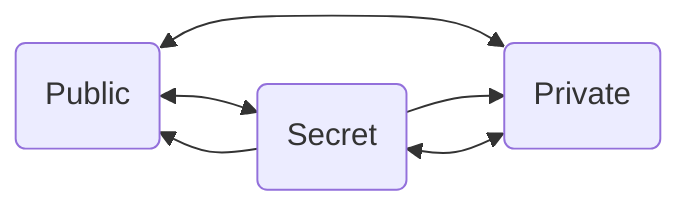
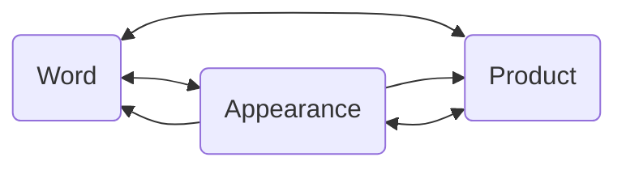

# Table of Contents
- [Table of Contents](#table-of-contents)
- [Techniques while speaking](#techniques-while-speaking)
- [Speaking Toolkit](#speaking-toolkit)
  - [1. Start your speech](#1-start-your-speech)
  - [2. As Ising](#2-as-ising)
  - [3. Target everyone of the four personalities at the beginning](#3-target-everyone-of-the-four-personalities-at-the-beginning)
- [4. Ask Questions don't set statements](#4-ask-questions-dont-set-statements)
- [5. Story Loops](#5-story-loops)
- [6. Create Goosebumps moments (emotions)](#6-create-goosebumps-moments-emotions)
- [7. Zooming In](#7-zooming-in)
- [8. Formulating](#8-formulating)
- [9. Three Faces](#9-three-faces)
- [10. Rules](#10-rules)
- [Steal good quotes](#steal-good-quotes)
  - [Questions](#questions)
    - [Questions to get a laugh through personality differences](#questions-to-get-a-laugh-through-personality-differences)
- [Psychological rules and effects](#psychological-rules-and-effects)
  - [Magical Triangle](#magical-triangle)
  - [Halo Effect](#halo-effect)
  - [Horns Effect](#horns-effect)
- [9 ToDo's after today](#9-todos-after-today)

# Techniques while speaking
1. Bring out your **teeth** to dry  (**Smile**)
2. Speak double loud => Energize
3. **Open** your **palms** while communicating
4. **Tilt** your **head** a little bit to your side
5. **Nod** (your head while communicating)
6. Pass **Headlights** always on to the others. Don't be your story's hero.
7. **Gestures** describe what we tell
   1. "I took the microphone" => Gesture how you took it => Hand to mouth
8. Don't present GERMAN
   1. No PowerPoints (at least include no black)
# Speaking Toolkit
## 1. Start your speech
Welcome people while [using techniques while speaking](#techniques-while-speaking)
   1. Perhaps with "I am so grateful that you are here today."
   2. Hand to your heart (gesture)
## 2. As Ising
If you don't know what to say, just say what happens in your life right now.  
It does not have to be happy, it can be sad, it can be funny, it can be anything.  
>Before I connect to people, I strip myself in front of them. I make myself naked.

Show vulnerability. Show humanity and every day feelings. You are not perfect.  
> Don't be the hero of your story! Be the student.

"I do not know something better and I am not better in doing something but I want to tell you a story how I learned ..."

Create pain and offer a solution. (e.g. I felt lonely after work ...)
> If you make yourself small in front of a group, you grow really big.

## 3. Target everyone of the four personalities at the beginning
Every person on this world asks one question.
> What's in it for me?

Try to address every personality type in a few sentences.
1. Shark
   * "What can others do for me?"
   * Seeks biggest benefits for himself.
   * Senses opportunities miles away.
   * Efficiency, profit, success
2. Whale
   * "What do other people gain from my existence?" or "How can I help them?"
   * Harmony, being together, friendly
   * Has whale friends.
     * > **A** people hang with **A** people. B with ... 
3. Dolphin
   * "Where is the next party?"
   * Loves risk, fun, communicating.
   * Stands for innovation, flexibility, "new", energy
4. Owl
   1. "Is everything planned?"
   2. Loves security and control
   3. Plans, organizes, questions everything
   4. Has a plan for organizing lugagge in the car. 

A person is in most cases not only one personality type.  
It depends on the situation and on the current "role" he plays.

# 4. Ask Questions don't set statements
Ask questions and never set statements.
Would you like to be asked or would you liked to be forced to a truth?
> Help people to remember.

# 5. Story Loops
1. Have a main story or topic
2. Drift away to some B-Story, memory, impression or association
3. Loop out again and continue your story. 

# 6. Create Goosebumps moments (emotions)
To create emotions the [zooming in method](#7-zooming-in) is great.
* Listeners have to taste what I experience.
* Paint with their color palette images and fantasy in their head.

> If you don't cry about your why, it's not your why!

If you don't feel it the specators won't as well.  
Show your emotions and make yourself "naked".  
> If you feel, the others feel.  

Learning means remembering => Help them to remember the knowledge aftwards.

# 7. Zooming In
We zoom from above in till the bottom is reached.  
Stars => Space => Earth => Europe => Sweden => Stockholm  

Create temperature through details.
  * Wooden benches
  * Birch forest
  * Campfire
  * Crackling

> Spectators are like a thermometer. They reflect your speech and the transported emotions.

```markdown
Imagine:
Birch Forest
In the middle of Germany
One like the one we used with our parents for a stroll
A clearing in the forest
Wooden benches in this clearing
Campfire
Crackling, Dancing flames
You look up
You see a crystal clear sky
You look down
You perceive the icecold ground
The cold sneaks slowly upwards through your knees
You take a step closer to the crackling fire.
The fire's warmth flows to you
On the opposite site sits an old woman.
You look in her face.
You see wrinkles all over.
Her shining, wise eyes reflect the crackling flames.
And she asks you: "May I tell you a story?"
```
So much better than just "May I tell you a story?"

# 8. Formulating
Your inner and outter voice has to be the same. (Talk truth)  
> Did you vomit, puke or choke bile?

Tell things how they have been. Don't talk things nice.

# 9. Three Faces
Everyone has three faces. Which one do you share?

1. Public is shown to Others
2. Priate is shown to family
3. Secret is shown to myself when I lie in bed, thoughts circle and dreams are formed.
# 10. Rules
1. > We don't help. We help people to help themselves.
2. Storytelling
   + If people call different things => Respond to it
     + "Tell a story"
     + "Show symptathy"
     + "Make me sad"
     + "Goosebumps"
     + "The main thing is that it finally works in my life!"
3. Being eloquent
    ```markdown
   How you managed to spread your wings when you stood on the brink. Not how you earned the first million. ```  
4. The mass consumes, does nothing and complains => Change it.
   1. I am no one of the "poets and thinkers" => I change.
   2. If information could make happy, than they would already be happy.
      1. Therefore I'm a leader!
   3. Bees never waste their time explaining flies that honey tastes better than shit.   
     => Leadership
   4. Just do!

# Steal good quotes
* Yes or yes?
  * Am I right or am I right?
  * Are you ready or are you ready?
  * Is it great or is it awesome?
* He's dead right now, but wasn't he a great person?
* You've got something special. You have greatness in you!
* You do not belong to yourself, but to the universe
* I promise you, now you have a chance!
* **Appear the first time as if it would be your first date.**
* Stories build bridges in the hearts of other people

## Questions
+ Tell me about a day in your life that changed so much, that nothing has been the same.
  + Which 3 things did you learn?
### Questions to get a laugh through personality differences
1. Ask: "How many of you love Ananas on pizza?"
2. Ask: "How many of you hate Ananas on pizza?"
3. Suggest: "Aren't the differences exactly what make us unique and bring us together?"
   * Correct formulated => Small laugh


# Psychological rules and effects

## Magical Triangle
> We love triangles and pyramids because they are **symmetric**.

+ The *word* is what we say.
+ The *appearance* how we look.
+ The *product* or *service* what we offer.

All points have to match. What we say with what we wear with what we offer.  
How to sell a lamborghini in rags?

>If people say yes *three* *times* in a row, **they buy**.

## Halo Effect
"The halo effect is a cognitive bias in which a person's overall impression of a person, place, or thing influences their judgment of that person, place, or thing's specific characteristics."

In halo you are either a bright, dimmed or dark light.

>The halo effect is a cognitive bias that occurs when an initial positive judgment about a person unconsciously colors the perception of the individual as a whole. 

It is not always positive.
When forming a first impression, observing an initial attractive feature—perhaps beauty or strength—can make the person appealing, making it difficult to revise that impression based on new or opposing information. For example, an attractive individual may also be perceived as interesting, ambitious, or funny, whether or not that assessment is warranted.

>If you have a positive impression of a person, you are likely to see positive characteristics in that person.

## Horns Effect
Counterpart to the halo effect.  
> The horn effect, a type of cognitive bias, happens when you make a snap judgment about someone on the basis of one negative trait.

```markdown
Say you meet your new supervisor, who’s bald, and immediately remember a bald middle school teacher who bullied and mocked you. Angry and afraid all over again, you distrust your boss immediately. Your bias led you to judge him by one trait — baldness — which your brain connected to that negative past experience.
```

# 9 ToDo's after today
> Financial Freedom is your birth right.
1. Aquire a mentor 
   + Educate yourself properly
2. No PowerPoints
   + Little Information on a page
   + Never use black & white
     + Close your eyes 
     + Imagine walking over a hill full of flowers
     + Imagine the feeling of touching them
     + of smelling them
     + No one imagines those images in black & white
3. Energy is key
   + Energize yourself and shape your body, mind and soul
4. Stage gives Stage
   + The more you speak, the more you will speak and be more popular
5. Write a book or script about **your** topic
   + Your topic should leave you talking with foam in front of the mouth
   + You can talk *endless* about your topic
6. Do everything different than the other people
   + Colored socks?
7. Learn to sell yourself!
8. Position yourself crystal clear (market?)
   + Communicate what I **want** and **don't want**
   + Marketing
9.  Be in the Social Media game